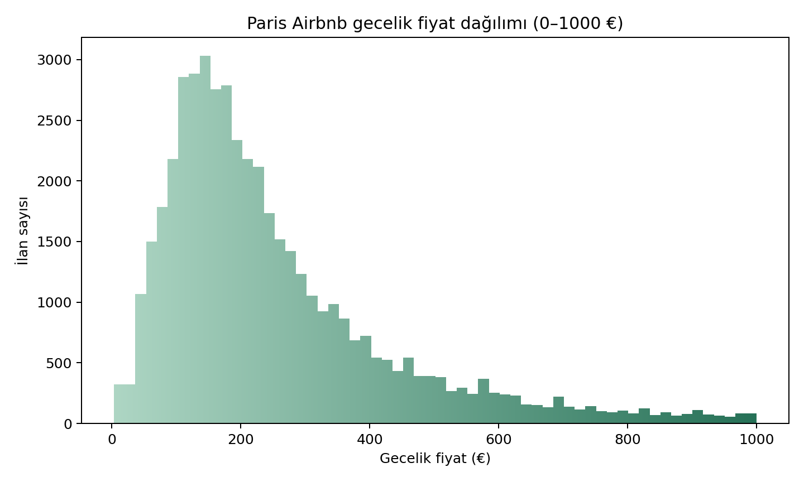
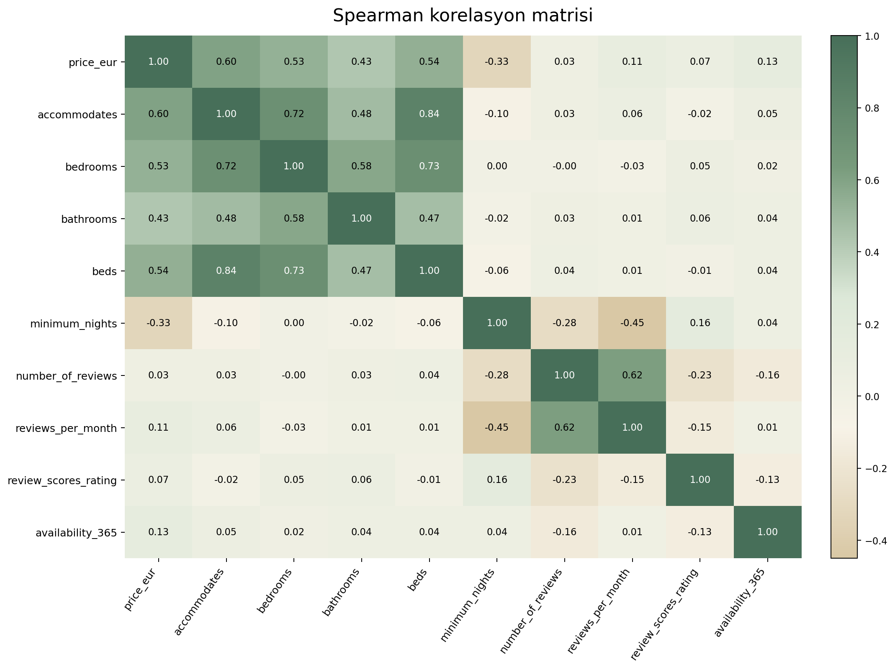
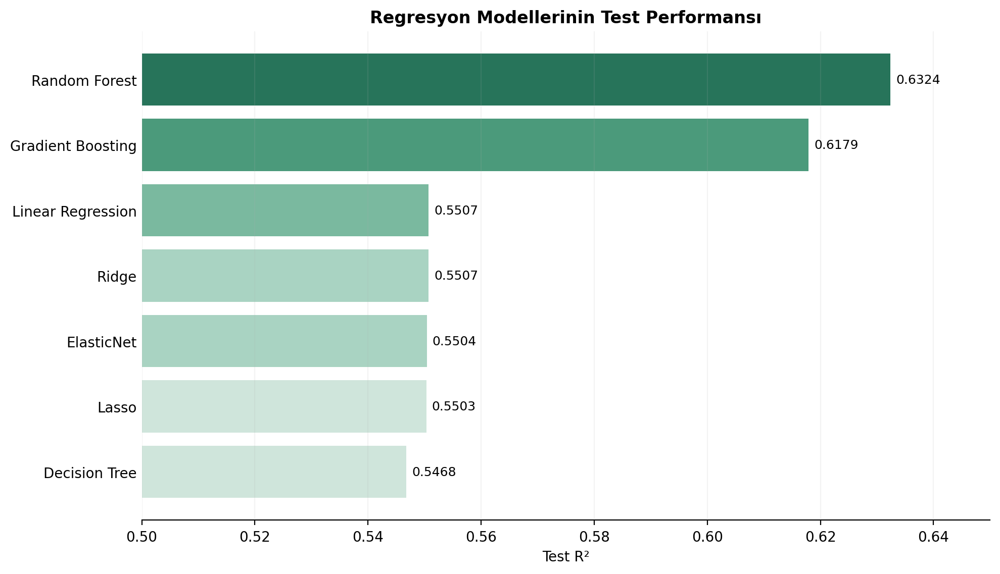
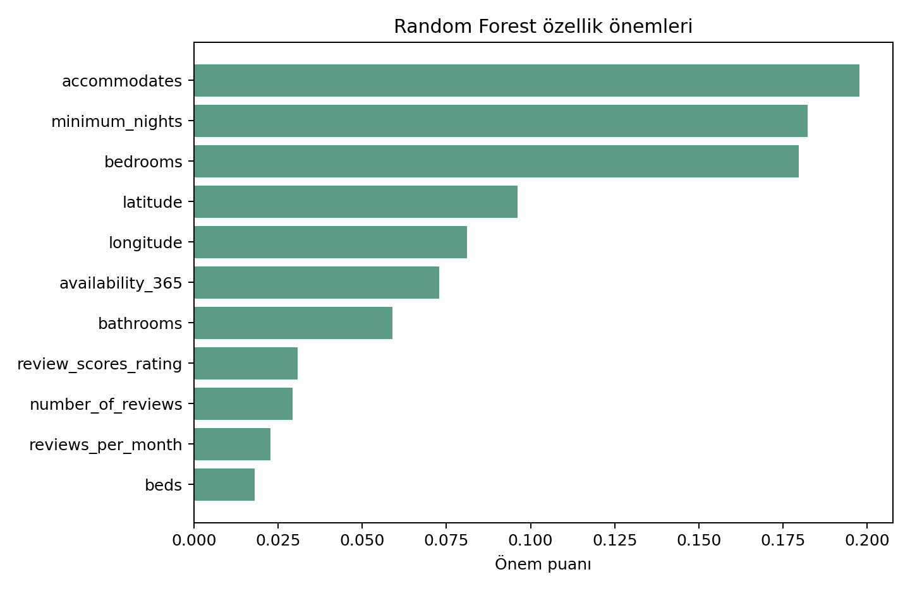

# Paris Airbnb Price Prediction

A machine learning project focused on predicting nightly Airbnb prices in Paris using listing characteristics, location information, and different regression algorithms.

The project covers the complete data analysis workflow, including data cleaning, exploratory data analysis, outlier detection, statistical analysis, model comparison, overfitting analysis, and hyperparameter tuning.

> **Note:** This project was originally developed in Turkish as an individual Data Analytics project. The notebook and full project report are therefore written in Turkish, while this README provides an English overview.

---

## Project Overview

Airbnb prices can vary considerably depending on factors such as accommodation capacity, room type, location, number of bedrooms, and minimum stay requirements.

The main objective of this project was to investigate these relationships and build a machine learning model capable of predicting nightly Airbnb prices in Paris.

The analysis also focused on two important modelling issues:

- How should outliers be handled without removing valid listings?
- How can overfitting be reduced while maintaining good predictive performance?

---

## Dataset

The project uses Paris Airbnb listing data obtained from **Inside Airbnb**.

After preprocessing, the analysis included **48,402 listings** with valid price information.

Some of the main features used in the analysis were:

- `accommodates`
- `bedrooms`
- `bathrooms`
- `beds`
- `room_type`
- `neighbourhood`
- `latitude`
- `longitude`
- `minimum_nights`
- `number_of_reviews`
- `reviews_per_month`
- `review_scores_rating`
- `availability_365`

The raw dataset is not included in this repository.

---

## Exploratory Data Analysis

The exploratory analysis examined the distribution of Airbnb prices, differences between room types, relationships between numerical variables, and potential outliers.

### Price Distribution



The price distribution is strongly right-skewed, with most listings concentrated in the lower and middle price ranges and a smaller number of high-priced listings forming a long right tail.

### Spearman Correlation



The strongest positive relationships with price were observed for accommodation-related variables such as `accommodates`, `beds`, `bedrooms`, and `bathrooms`.

---

## Outlier Analysis

Outliers were investigated using the **Interquartile Range (IQR)** method.

Instead of automatically removing every observation identified as an outlier, the structure of each variable was examined individually.

For example, the `bathrooms` variable produced an IQR of zero because a large proportion of listings had the same value. Automatically applying the IQR rule in this situation would incorrectly classify many valid observations as outliers.

For this reason, a more conservative strategy was used during modelling to limit the influence of extreme values without unnecessarily removing valid listings.

---

## Machine Learning Models

Seven regression approaches were compared:

1. Linear Regression
2. Ridge Regression
3. Lasso Regression
4. ElasticNet
5. Decision Tree
6. Gradient Boosting
7. Random Forest

Model performance was evaluated using:

- **R²**
- **RMSE**
- **MAE**

---

## Model Performance

| Model | Test R² | RMSE (€) | MAE (€) |
|---|---:|---:|---:|
| Linear Regression | 0.5507 | 90.33 | 66.31 |
| Ridge | 0.5507 | 90.33 | 66.31 |
| Lasso | 0.5503 | 90.36 | 66.30 |
| ElasticNet | 0.5504 | 90.36 | 66.32 |
| Decision Tree | 0.5468 | 90.72 | 64.98 |
| Gradient Boosting | 0.6179 | 83.30 | 59.78 |
| **Random Forest** | **0.6324** | **81.71** | **58.06** |

### Model Comparison



**Random Forest achieved the best overall test performance**, with:

- **Test R²:** 0.6324
- **RMSE:** €81.71
- **MAE:** €58.06

---

## Overfitting Analysis

An initial Decision Tree model showed a substantial difference between training and test performance, indicating overfitting.

Several strategies were therefore evaluated:

- limiting tree complexity,
- comparing training and test scores,
- testing different training dataset sizes,
- using cross-validation,
- tuning Random Forest hyperparameters with `GridSearchCV`.

Reducing the amount of training data did not improve generalization. In fact, test performance increased as more training data was used.

The final Random Forest model achieved:

- **Train R²:** 0.7562
- **Test R²:** 0.6324

This indicates that some train-test gap remains, but overfitting was substantially reduced compared with the initial unrestricted tree model.

---

## Feature Importance



Features related to accommodation capacity and listing characteristics played an important role in the final model. Location variables such as latitude and longitude also contributed to price prediction.

---

## Key Findings

- Paris Airbnb prices show a strongly right-skewed distribution.
- Accommodation capacity is strongly associated with nightly price.
- Room type has a noticeable relationship with price.
- Automatically removing all statistical outliers can lead to loss of valid observations.
- Tree-based models performed better than the linear regression approaches tested.
- Using less training data did not solve overfitting.
- Random Forest provided the best overall predictive performance.

---

## Repository Structure

```text
paris-airbnb-price-prediction/
│
├── README.md
├── paris_airbnb_price_prediction.ipynb
├── requirements.txt
│
├── images/
│   ├── price_distribution.png
│   ├── correlation_matrix.png
│   ├── model_comparison.png
│   └── feature_importance.png
│
└── report/
    └── Paris_Airbnb_Price_Prediction_Report.pdf
```

---

## Technologies

- Python
- Pandas
- NumPy
- Matplotlib
- Seaborn
- SciPy
- Scikit-learn
- Google Colab

---

## Project Report

The complete project report, including methodology, statistical analysis, model evaluation, literature review, and conclusions, is available in the [`report`](report/) directory.

---

## Medium Article

I also wrote about the project and the main lessons I learned while working with outliers and overfitting:

**Predicting Paris Airbnb Prices with Machine Learning: What I Learned About Outliers and Overfitting**

[Read the article on Medium](https://medium.com/@feyzanurdmrbas/predicting-paris-airbnb-prices-with-machine-learning-what-i-learned-about-outliers-and-overfitting-a4971943b991)

---

## Author

**Feyza Nur Demirbas**

Mathematics student interested in data analytics, machine learning, and data-driven problem solving.
